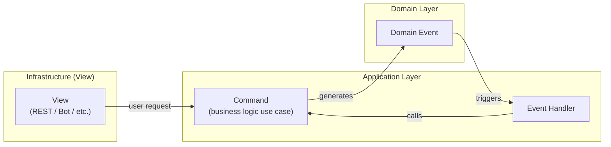

### Сервис пошагового обучения с ИИ ассистентом

---

#### Запуск для разработки

```
docker compose up -d
```
```
python3 -m src.main
celery -A src.infra.celery_start:celery_app worker --loglevel=info
```

Проект реализован в парадигме чистой архитектуры (Clean Architecture). Это позволило обеспечить независимость бизнес-логики от внешних механизмов доставки (Telegram, REST API), баз данных, шин сообщений и AI-сервисов.

Используется Event-driver подход. Доменные команды генерируют события в шину. Сервисы-обработчики слушают эти события и вызывают команды.

#### Организация потока данных



#### Архитектурные слои:

Domain — модели, события, порты к моделям и протоколы сервисов

Application - обработчики событий, команды бизнес-логики

Infrastructure — реализации портов, доступ к данным, представления
